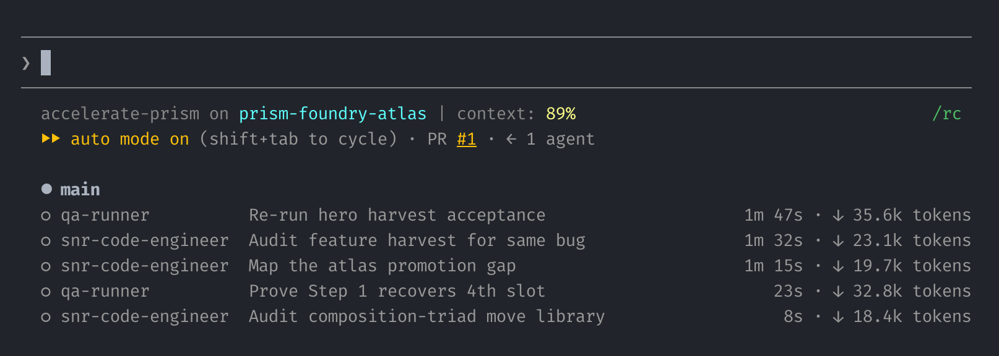

# prompt-relay

<p align="center">
  
</p>

**Your smartest model should be *deciding*, not *typing*.**

`prompt-relay` is a copy-paste routing template for coding agents: your expensive model decides,
cheap models execute, a strong one advises. Six roles, a few files. No framework, no lock-in.

- **On Claude Code it cuts your token bill ~40–60%** and pushes usage limits hours further out.
- **On Codex it's your spend cap** — fan-out is on by default there and inherits your lead model,
  so the same roles pin it down instead of thinning it out.

Paste this into your agent — it interviews you, proposes a role→model map, and installs only after
you approve:

> ```Install prompt-relay: read https://github.com/noeltock/prompt-relay/blob/main/docs/install.md, propose a role→model mapping for my stack, and install only after I confirm. Back up anything you touch; never overwrite my rules.```

## How it works
One principle: an expensive, smart model **decides** (scope, architecture, review); cheap models
**execute**; a strong model **advises** on the few hard calls. Everything routes by *role*, not
model name, so it survives any rename or swap:

| Role | Does | Example model (edit) |
|---|---|---|
| `lead` | scopes, decides, reviews — your session model | Opus (low effort) |
| `coder-low` | fully-specified mechanical work | a cheap fast model (Sonnet, or a cheap Codex model) |
| `coder-high` | messy diffs, judgment among patterns | a stronger model at higher effort |
| `advisor` | second opinion, advisory only | your strongest reasoner |
| `qa` | runs tests/checks, reports pass/fail | a cheap model |
| `runner` | web / transforms / dumb sweeps | the cheapest model |

Works at two tiers: a single copy-paste file today, or named reusable sub-agents when you want the
full multi-agent version. Copy what you need, delete the rest.

## On Claude Code
Delegation here is a **discount**: the lead re-reads its own transcript as cache every turn, so
moving execution off it is what shrinks the bill — that's where the ~40–60% comes from. Spawning is
explicit opt-in, so nothing fans out unless you asked.

- **Start:** paste [`CLAUDE.md`](CLAUDE.md)'s routing section into your `~/.claude/CLAUDE.md` and
  edit the Roster block.
- **Level up:** copy [`agents/`](agents/) for named sub-agents,
  [`settings.example.json`](settings.example.json) to pin the lead model.
- **Full steps:** [`docs/install.md`](docs/install.md) — agent-runnable or by hand.

## On Codex
Same roles, opposite economics: multi-agent is **native and on by default**, and an unpinned
subagent silently inherits your lead's expensive model. Here the routing is a **spend cap** — pin
the cheap tier, bound the fan-out, and watch the log to confirm the pins took. No saving is
benchmarked on this harness; containment is the product.

- **Start (and finish):** [`profiles/codex-AGENTS.md`](profiles/codex-AGENTS.md) — config pins for
  `~/.codex/config.toml`, the roster mapped to Codex's built-in roles, and three silent-failure
  modes, each verified or labelled otherwise.
- **Not optional:** the [`logger/`](logger/) Codex hook — the only way to notice a runaway fan-out
  before the bill.

*(Mixed stack — Claude lead, Codex executors? That's the worked example in the
[install guide](docs/install.md) and `references/routing.md`.)*

## What you copy
| You want | Copy | Notes |
|---|---|---|
| The routing core | `CLAUDE.md` *(Claude)* or `profiles/codex-AGENTS.md` *(Codex)* | the one required piece; edit only the Roster block |
| Named sub-agents | `agents/*.md` | optional upgrade — persistent role contracts |
| The deep mechanics | `references/routing.md` | hard-won rules, each distilled to the failure it prevents |
| Spawn audit + learning loop | `logger/`, `hooks/`, `learned/` | one JSONL row per delegation; a twice-seen failure becomes a printed pre-commit check |

## The receipts
Verified first-party where possible (e.g. Codex fan-out defaults checked against the
`codex-cli 0.145.0` binary), practitioner reports labelled as reports, and one honest gap: nobody —
including us — has benchmarked the delegation half in public. The full tiered ledger with every
handle and link: [`docs/evidence.md`](docs/evidence.md).

---

*Ready? Paste the one-liner at the top, or start at [`docs/install.md`](docs/install.md).*
