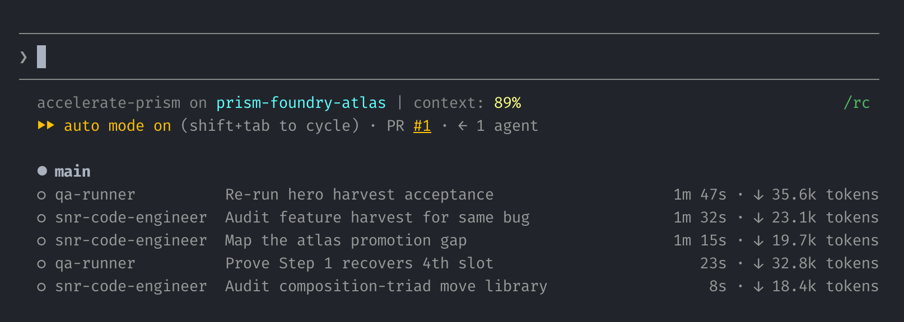

# prompt-relay

<p align="center">
  
</p>

**Keep your best model on the decisions that need it.**

Routing templates for Claude Code and Codex. The lead owns scope, architecture and review, workers get bounded jobs, and an advisor weighs in on the hard calls. Six roles, Markdown and TOML, no orchestration framework to babysit.

## What changed (October 2026)

Until recently the clever setup was spreading work across vendors: plan on Claude, execute on Codex, stretch two allowances instead of one. That trade has mostly gone. Opus 5.5 and Sonnet 5.5 cover almost everything on their own, and Claude Code now ships a built-in advisor. Meanwhile OpenAI's $200 Pro plan drops from 20x to 10x Plus usage for Codex on 30 October, so offloading there for quota is getting worse, not better.

So the default here is now Claude-only. Codex keeps two jobs: reviewer from a different model family (it misses different things, which is the point of a second opinion), and its own harness if that's where you live, where OpenAI pitches GPT-6.1 Sol as close to Astra at a fifth of the price. Cross-vendor execution stays in the repo as an option for quota overflow. That's my read of the last few weeks, with dated sources in [the evidence notes](docs/evidence.md). We'll see how long it holds.

## Install

Paste this into your agent:

```text
Install prompt-relay: read https://github.com/noeltock/prompt-relay/blob/main/docs/install.md, propose a role→model mapping for my stack, and install only after I confirm. Back up anything you touch; never overwrite my rules.
```

It asks about your setup, proposes a mapping and waits for your OK. You end up with a compact roster: what's configured, what's been verified by a live run, and whether you need a fresh session.

| Your setup | Start here |
|---|---|
| Claude Code (default) | [Claude profile](profiles/claude-CLAUDE.md), with optional [hooks](hooks/claude/) |
| Codex only | [Codex profile](profiles/codex-AGENTS.md) and [custom-agent TOMLs](profiles/codex-agents/) |
| Mixed (optional) | [Installation guide](docs/install.md): Claude reaches Codex through a wrapper agent, mainly for quota overflow |

## Start with the native knobs

Before installing any roles, use what Claude Code already ships:

- `opusplan` runs Opus in plan mode and Sonnet for execution.
- `CLAUDE_CODE_SUBAGENT_MODEL` sets a model for any subagent you didn't pin. Skip the `_FORCE` variant, it overrides the roles you pinned on purpose.
- `/advisor` (or `advisorModel`) puts a stronger model on the whole session, consulted before a plan, on a recurring error and before "done". It has to rank at or above your main model.

Details in the [model config](https://code.claude.com/docs/en/model-config.md) and [advisor](https://code.claude.com/docs/en/advisor.md) docs. The roles below cover what these don't.

## Roles

| Role | Does | Claude example | Codex example |
|---|---|---|---|
| `lead` | Scope, architecture, security calls, review | Opus 5.5 / low | GPT-6.1 Sol / medium |
| `coder-low` | Bounded work with the approach already settled | Sonnet 5.5 / medium | GPT-6 Luna / high |
| `coder-high` | Diagnosis, messy diffs, judgment among existing patterns | Sonnet 5.5 / high | GPT-6.1 Sol / medium |
| `advisor` | Second opinion, advice only | Built-in `/advisor` on Fable | GPT-6 Astra / medium |
| `qa` | Named checks with evidence, no fixes | Sonnet 5.5 | GPT-6 Luna / medium |
| `runner` | Searches, fetches, non-code transforms | Haiku 4.5 | GPT-6 Luna / medium |

These are starting choices for October 2026, not benchmark results. Two rules hold whatever you pick. A known file isn't a known fix, so settle the decision or find the cause before handing implementation down. And never put Astra Ultrafast in a Codex subagent, it burns allowance at 8x.

## See what actually ran

The failure here is silent. An agent can finish the job perfectly well on the wrong model, and nothing tells you. So every dispatch and completion gets one line:

> **🔧 Coder Low** · Dispatched: implement the approved settings change · requested Sonnet 5.5 / medium

> **🔧 Coder Low** · Done: settings change implemented and checks passed · verified Sonnet 5.5 / medium

It says **requested** until a transcript proves the model and effort. Then check:

```bash
bash verify/check-routing.sh --since 7
bash verify/check-routing-codex.sh --since 7
```

Both take `--roster FILE`, `--after TIMESTAMP` and `--json`. Prefix shared role names with `claude:` or `codex:`, and look at coverage: a run that matched no rules tells you very little. A worker that was already running keeps its old settings after you change a pin, so check its next observed model. For long Codex companion jobs, `verify/wait-on-liveness.sh --id <job-id>` waits on the job rather than a clock. All of it is in the [verification guide](verify/README.md).

## Claude Code hooks (optional)

Instructions get skipped under context pressure, hooks don't. The [PreToolUse hooks](hooks/claude/) block large unscoped reads and bare `cat`/`head`/`tail` on big files (redirecting to a scoped read, a scout or `bin/bulk-read`), and pin unpinned `Explore` and `general-purpose` spawns to your cheap model. Skill-launched agents need their own frontmatter pins.

[`bin/bulk-read`](bin/bulk-read) sends files plus a question to a cheap model and returns bullets, so the corpus never touches the lead's transcript. Spotify describes the same shape in its [Portal write-up](https://engineering.atspotify.com/2026/9/portal-by-spotify-cut-my-claude-code-token-usage-by-90). Wiring lives in `settings.example.json`.

## What's in here

| Path | Contents |
|---|---|
| `agents/` | Optional Claude sub-agents, plus the Codex forwarder for mixed setups |
| `profiles/codex-agents/` | Native Codex leaf contracts and model pins |
| `references/routing.md` | Routing mechanics and the failures behind them |
| `verify/` | Transcript checkers and the waiting helper |
| `evals/` | 20 routing cases, 5 install scenarios, and deterministic script checks |
| `docs/evidence.md` | Sources, practitioner reports and what's still open |

```bash
bash evals/run-claude-verifier-evals.sh   # 10 cases
bash evals/run-codex-verifier-evals.sh    # 18 cases
bash evals/run-liveness-evals.sh          # 20 cases
bash evals/run-hook-evals.sh              # 17 cases
```

The fixtures check script behaviour. Proving a model/effort pair on your machine still takes a live canary.

## About savings

Delegation can shrink a Claude Code bill when it keeps an expensive lead transcript small. On Codex, OpenAI says subagent workflows use more tokens than a comparable single agent. And on a subscription, handing work to Sonnet doesn't guarantee fewer tokens than Opus doing it (a few practitioners report the opposite).

So there's no savings percentage here, and the ones going around on X mostly have no control behind them. Check which routes actually ran, compare them with the work you accepted, and decide from there.
